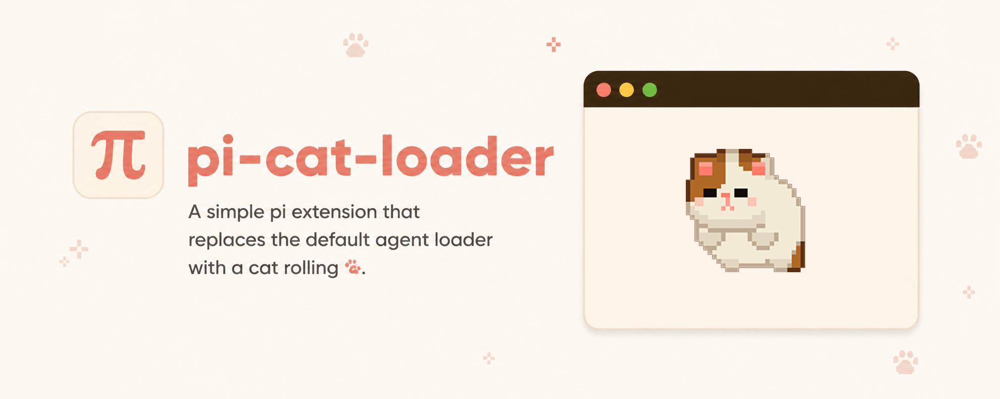

<p align="center">
  
</p>

# pi-cat-loader

Animated rolling cat loader for [pi](https://pi.dev). Replaces pi's inline spinner with cat animation and adds `/cat-loader` command controls.

## Installation

```bash
pi install npm:@kyuc/pi-cat-loader
```

## Commands

```text
/cat-loader on                    Enable cat loader
/cat-loader off                   Disable cat loader
/cat-loader preview               Show cat loader for 5 seconds
/cat-loader clear                 Clear terminal images
/cat-loader size <value>          Set width (small, medium, large, or 1-20)
/cat-loader color <color>         Set color (classic, black, gray, white, yellow)
/cat-loader help                  Show help
```

## Configuration

Settings are saved under pi's `catLoader` config key. You can change these through `/cat-loader` commands, or edit pi settings directly:

```json
{
  "catLoader": {
    "enabled": true,
    "sizeCells": 4,
    "color": "classic"
  }
}
```

`sizeCells` must be `1-20`. `color` must be `classic`, `black`, `gray`, `white`, or `yellow`.
