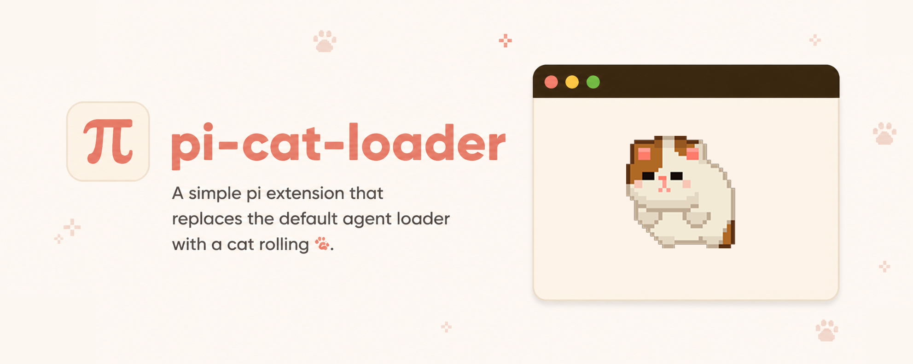

<p align="center">
  
</p>

# pi-cat-loader

Animated rolling cat loader for [pi](https://pi.dev). Replaces pi's inline spinner with cat animation and adds `/cat-loader` command controls.

https://github.com/user-attachments/assets/b2ad6d9b-f83b-4dcc-8f00-bff028aa1993

## Compatibility

This extension requires a terminal with inline image support. Known terminals that work include:

- Ghostty
- Kitty
- WezTerm
- iTerm2

This extension does not work inside tmux. When tmux is detected, the cat loader is automatically disabled and pi falls back to its regular spinner.

## Installation

```bash
pi install npm:@kyuc/pi-cat-loader
```

## Commands

```text
/cat-loader on                    Enable cat loader
/cat-loader off                   Disable cat loader
/cat-loader preview               Show cat loader for 5 seconds
/cat-loader clear                 Clear terminal images
/cat-loader size <value>          Set each cat's width (small, medium, large, or 1-20)
/cat-loader speed <value>         Set frame rate (slow, normal, fast, or 1-60 FPS)
/cat-loader color <colors...>     Set 1–5 ordered colors (classic, black, gray/grey, white, peach, random)
/cat-loader help                  Show help
```

## Multiple cats

```text
/cat-loader color white black grey
/cat-loader color black black white gray peach
/cat-loader color classic
/cat-loader color white random random
```

Choose 1–5 cats in left-to-right order; repeated colors are allowed. One color returns to a single cat. Cats animate in sync at the same speed, with one-cell gaps. Size applies to each cat. When the terminal is too narrow, trailing cats are hidden until space is available—cats never shrink or wrap.

Each `random` slot independently picks from the five colors with equal odds at the start of each loading run or preview. Picks stay fixed across animation frames, redraws, and resizing. Duplicates and repeated picks between runs are allowed. Settings retain `random`, not the picked colors.

## Configuration

Settings are saved under pi's `catLoader` config key. You can change these through `/cat-loader` commands, or edit pi settings directly:

```json
{
  "catLoader": {
    "enabled": true,
    "sizeCells": 4,
    "framesPerSecond": 20,
    "colors": ["white", "black", "gray"]
  }
}
```

`sizeCells` must be `1-20` per cat. `framesPerSecond` must be `1-60`. `colors` must contain 1–5 entries: `classic`, `black`, `gray`, `white`, `peach`, or `random`. `grey` is accepted and saved as `gray`. Default: one `classic` cat. Invalid lineups fall back to this default.

Legacy `"color": "black"` settings load as `"colors": ["black"]`. Within one settings file, `colors` takes precedence over `color`. Project settings override global settings, including legacy colors. Commands save the new `colors` format globally.
